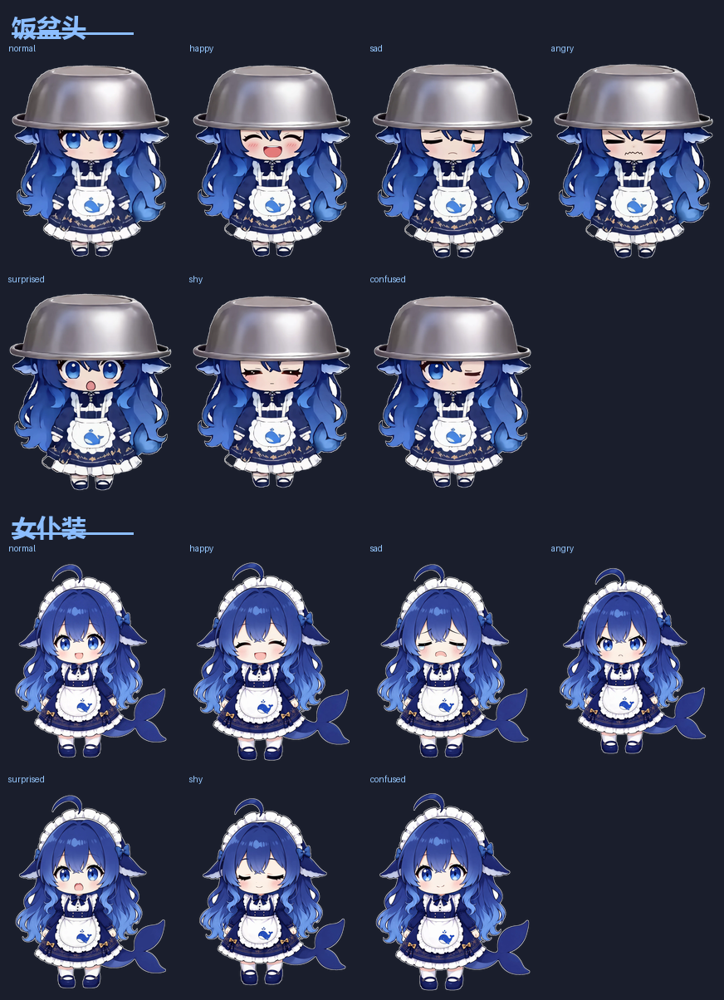

<p align="center">
  
</p>

<h1 align="center">白饭鱼</h1>

<p align="center">
  一只吃白饭的鲸鱼娘，挂在你的手机桌面上
  <br>
  <b>不联网 · 不上传 · 不要账号</b>
</p>

---

## 它是什么

一个 Android 桌面宠物。她以一个极小的悬浮窗浮在屏幕上：

- 在你刷抖音、看视频的时候，**嫌她挡视野就拖到屏幕侧边** —— 她会扒在边上，只露一个脑袋看着你
- 点她一下换一个表情，顺便吱一声（小黄鸭音效，可关）
- 长按弹出「设置 / 关闭」

所有东西都在你手机本地，**没有任何网络请求**。

<p align="center">
  
</p>

---

## 作者

| | 负责 |
|---|---|
| **[@LIN428924379](https://github.com/LIN428924379)** | 原作者 —— 角色设定、美术、交互设计、**Android 版** |
| **[@duhaoze2007](https://github.com/duhaoze2007)** | **Windows 版与 macOS 版** —— 用原生 C++ / Swift 重写，并额外做了悬停气泡、自动换表情、菜单栏图标等功能 |

「白饭鱼」现在是一个项目、多个平台：Android 版由原作者独立完成，桌面端移植由社区独立维护。
三份实现共用同一套角色和美术资源，交互设计一脉相承。

---

## 能做什么

| 功能 | 说明 |
|---|---|
| **悬空漂浮** | 缓慢浮沉 + 呼吸，动态幅度可调 |
| **拖拽** | 按住拖到任意位置，拖动时朝拖动方向倾斜 |
| **扒边** | 拖到屏幕左右边缘松手，她扒在边上、头旋转 90° 只露一个脑袋 |
| **两套皮肤** | 「饭盆头」和「女仆装」，长按她能换 |
| **点击换表情** | 每套皮肤 7 个表情循环（原样 + 开心/难过/生气/惊讶/害羞/疑惑），整张立绘切换 |
| **自动溜达** | 闲着的时候她自己爬来爬去，走一段歇一会儿；碰她/拖她/趴边时不动，可开关 |
| **小黄鸭音效** | 点击时随机播一个真实的小黄鸭吱声，可开关 |
| **长按菜单** | 「皮肤」原地换一套形象、「设置」直接进 App、「关闭」收回她 |
| **三档调节** | 悬空大小 / 扒边时脑袋宽度 / 动态幅度 |

---

## 怎么用

1. 安装后打开 App，点「**授予「显示在其他应用上层」**」，在系统设置里打开
2. 回来点「**让她出现**」，她就浮在屏幕上了
3. **按住拖动** —— 拖到屏幕左右边缘松手，她会扒在边上
4. **点一下**换表情，**长按**弹出设置/关闭

> **她要是过一会儿不见了**，多半是被系统省电策略杀掉了。到系统设置里给她加上「**自启动**」和「**后台运行无限制**」。
> 小米 / 华为 / OPPO / vivo 都需要这一步，原生安卓一般不用。

---

## 其他平台

原版是 Android。社区把它移植到了桌面端，两套皮肤和 14 个表情都搬了过去：

| 平台 | 仓库 | 说明 |
|---|---|---|
| **Windows** | [duhaoze2007/Baifanyu-For-Win](https://github.com/duhaoze2007/Baifanyu-For-Win) | 原生 C++，编译出来是一个 `.exe` |
| **macOS** | [duhaoze2007/Baifanyu-For-Mac](https://github.com/duhaoze2007/Baifanyu-For-Mac) | 原生 Swift，浮在全屏窗口之上 · **[介绍网站](https://baifanyu.jackdu.cloud)** |

macOS 版有一个[介绍网站](https://baifanyu.jackdu.cloud)，中英繁体三语，写了安装步骤、和安卓版的技术对照，也照实列了已知问题。

谢谢 [@duhaoze2007](https://github.com/duhaoze2007) —— 他们还加了几个原版没有的东西：
鼠标停在她身上会停下来并弹出日期和时钟，没人理她的时候她会自己换个表情。

---

## 自己编译

需要：**JDK 17** + **Android SDK（compileSdk 36）**

```bash
git clone https://github.com/LIN428924379/baifanyu.git
cd desktop-pet

# 告诉构建工具 SDK 在哪（这个文件不要提交）
echo "sdk.dir=/path/to/Android/Sdk" > local.properties

./gradlew assembleDebug
# 产物：app/build/outputs/apk/debug/app-debug.apk
```

最低支持 **Android 7.0（API 24）**，目标 **API 36**。纯 Java，无第三方依赖。

---

## 技术说明

做这个项目的过程中踩了几个坑，记在这里，别人做同类东西可以少走弯路。

### 1. 悬浮窗的三条铁律

做桌面宠物最容易一次踩满三个坑：

- **窗口必须贴着宠物轮廓，绝不做全屏透明层。** Android 12+ 有「obscured touch」机制，不透明度高的悬浮窗盖住的地方会拦截穿透下去的触摸，用户点不到下面 App 的按钮。窗口小，这一整类问题都不存在。
- **必须带 `FLAG_NOT_FOCUSABLE`。** 否则抖音会失焦，用户打字评论时输入法弹不出来。
- **不可见时真的要停止渲染。** 在 `onWindowVisibilityChanged` 和亮灭屏广播里停掉帧回调。屏幕关了还在 `postFrameCallback` 是纯烧电，这个 bug 极常见。

### 2. 表情为什么是「整张换图」，而不是「贴一块脸」

最初的做法是：保留身体，只在脸上叠一小块表情贴片。**试了六种遮罩策略，全都不成立。**

原因是表情图和底图是**两次独立生成**的 —— 五官位置差 10~25px、缩放还差 2%。于是：

| 遮罩策略 | 结果 |
|---|---|
| 大矩形 + 羽化 | 跨过头发/皮肤边界 → 额头上一块亮斑 |
| 脸形遮罩 | 不跨边界了，但偏移后的眉毛露出来 → **双眉毛** |
| 脸形 ∪ 偏移脸形 | 两条眉毛都盖住 → 又跨回头发 → 接缝 |

**每个方案都是在「露接缝」和「露重影」之间换一个。** 这不是调参能解决的。

最后改成**整张立绘切换**：每张图内部是自洽的（脸和头发出自同一次生成），问题从结构上消失。代价是素材体积变大、内存要按需解码。

> 教训：**遇到怎么调都不对劲的方案，先怀疑方案本身，而不是继续调参数。**

### 3. 自适应图标的 66% 安全区

Android 8.0+ 用自适应图标（`mipmap-anydpi-v26`）：一个 108dp 的画布，但**启动器只显示中间约 66%**。

我第一版把前景内容放到画布的 78%，结果**整个背景（白底）落在可视区之外**，用户看到的还是旧的深色底 —— 排查了很久才想到是几何问题。

正确做法：前景内容缩到 **60~72%**，保证裁完之后四周还有底。

### 4. 吸附阈值不能是固定值

拖到边缘吸附的判定，一开始写的是固定 `56dp`。但她调小之后窗口本身就窄，56dp 占了她宽度的一大半 —— **稍微靠近边缘就被吸走**。

改成 `min(56dp, 窗口宽度 × 25%)`：她越小，判定区跟着收窄。

### 5. 扒边态复用同一张图

趴边状态下只有头露出来，看起来需要一张单独的"趴姿"素材。实际上**把同一张立绘顺时针转 90°、只画头部区块**就够了 —— 不用多出一张图，表情贴图也能跟着旋转复用。

---

## 项目结构

```
app/src/main/
  java/com/whalepet/
    MainActivity.java     设置界面（权限引导 + 三档调节 + 音效开关）
    PetService.java       前台服务、悬浮窗、拖拽、边缘吸附、长按菜单、音效
    PetView.java          绘制与动画、表情切换、降帧
  assets/
    pet_stand.png         基准立绘
    pet_face_*.png        6 个表情立绘（各自按身体对齐过）
  res/raw/duck*.wav       真实小黄鸭叫声（3 个音高变体）
tools/
  make_duck.py            早期用代码合成音效的脚本（已被真实素材取代，留作参考）
```

---

## 已知的问题

- **表情切换时头发边缘可能有一两像素的抖动** —— 6 张立绘的身体不是像素级一致（两次独立生成的固有限度）
- **`害羞` 和 `疑惑` 两个表情区分度不够**，都是温柔微笑
- **呆毛和长发是"硬"的** —— 目前只有整体变换（浮沉/倾斜/挤压），没有网格形变，所以动起来头发不跟着甩

---

## 素材与致谢

- **角色形象**：DeepSeek 拟人化的鲸鱼娘，出自社区创作
- **立绘与表情**：由可灵 AI / 即梦 AI 生成，作者后期对齐去背
- **音效**：小黄鸭叫声来自 [Mixkit](https://mixkit.co/free-sound-effects/duck/)（Mixkit Free License，免费商用、无需署名）

> ⚠️ **注意**：角色的美术资源属于社区同人创作，**本项目的开源许可只覆盖代码**，美术资源请勿商用。

---

## 许可证

代码采用 **MIT License**，详见 [LICENSE](LICENSE)。
美术资源（`app/src/main/assets/`、`docs/`、`app/src/main/res/mipmap-*`）**不在 MIT 范围内**，仅限个人非商业使用。


## 音效诊断版
本版本增加“音效诊断 / 测试”按钮，会显示 sound_on、3 个 WAV 的 SoundPool 加载状态，以及媒体/系统音效音量，用于排查 Android/HyperOS 音频通道问题。
